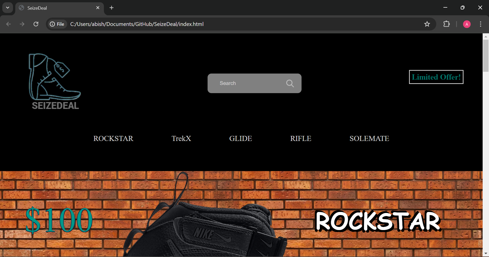
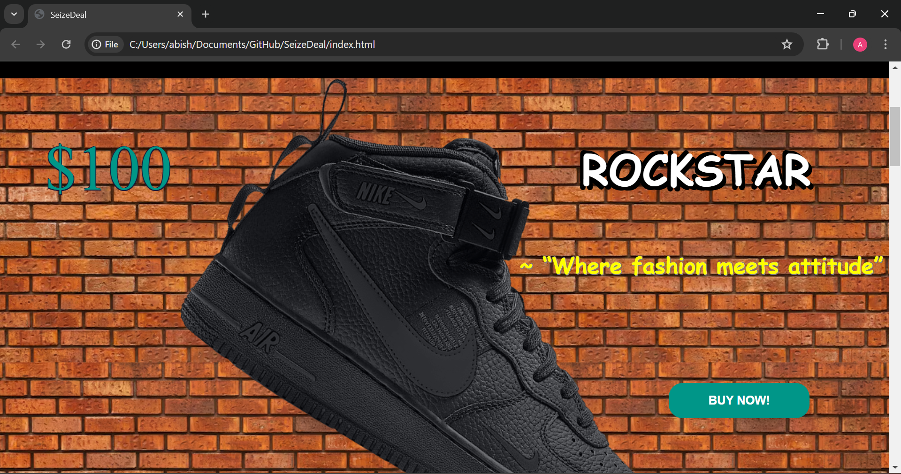
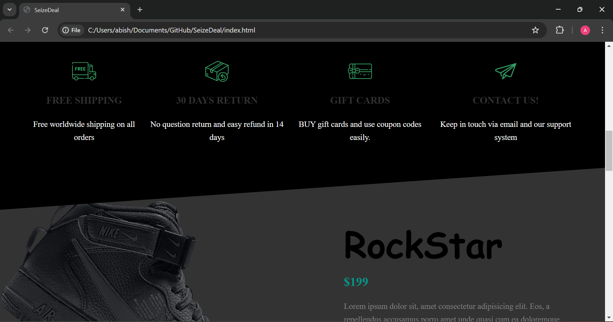
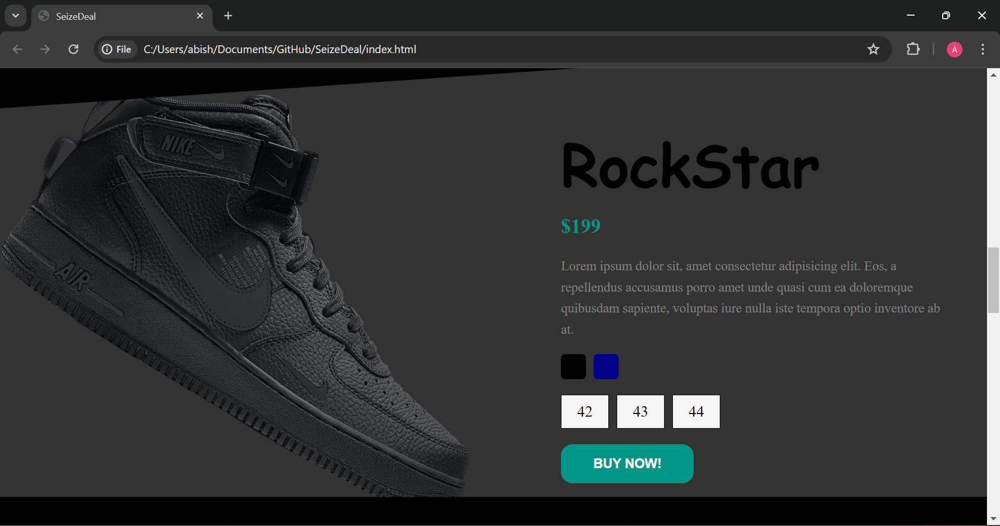
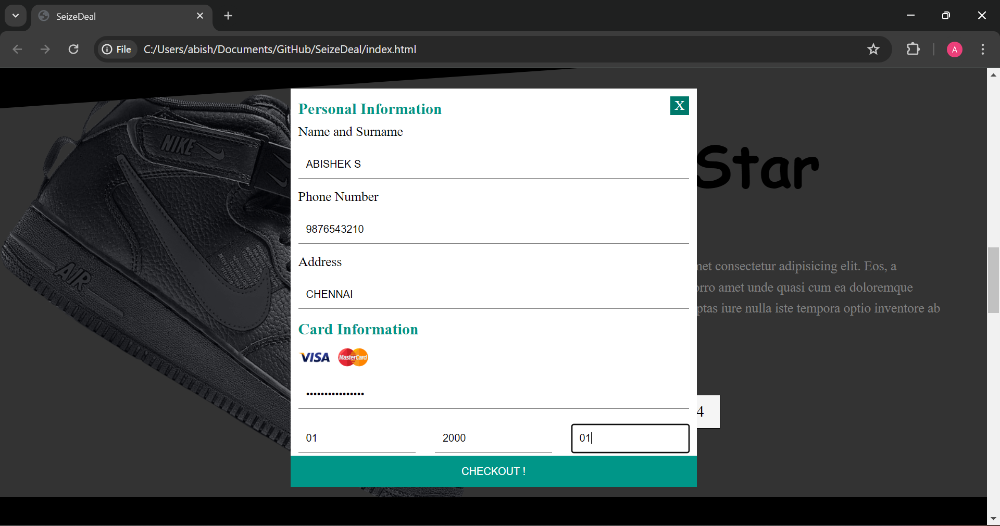
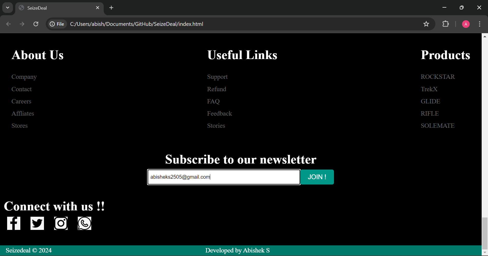

# SeizeDeal

SeizeDeal is a frontend project for an e-commerce platform. It allows users to browse products and apply various filters based on size and color.

## Live Demo: [Click Here](https://abishek25s.github.io/SeizeDeal/)

## Features

- **Browse Products**: View a list of products available on the platform.
- **Filter Products**: Apply filters to products based on size and color.

## Installation

To set up and run this project locally, follow these steps:

1. **Clone the repository**:
    ```sh
    git clone [<repository_url>](https://github.com/abishek25s/SeizeDeal)
    ```

2. **Navigate to the project directory**:
    ```sh
    cd SeizeDeal
    ```

3. **Open the `index.html` file** in your preferred web browser:
    Alternatively, you can open the file directly from your file explorer.

## ScreenShots.








## Contact

If you have any questions or feedback, feel free to reach out via email:

- **Email**: [abisheks2505@gmail.com](mailto:abisheks2505@gmail.com)
